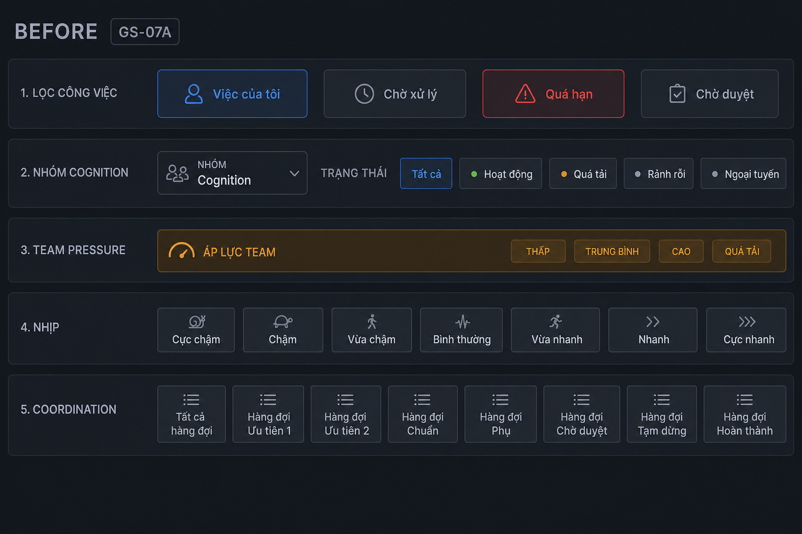
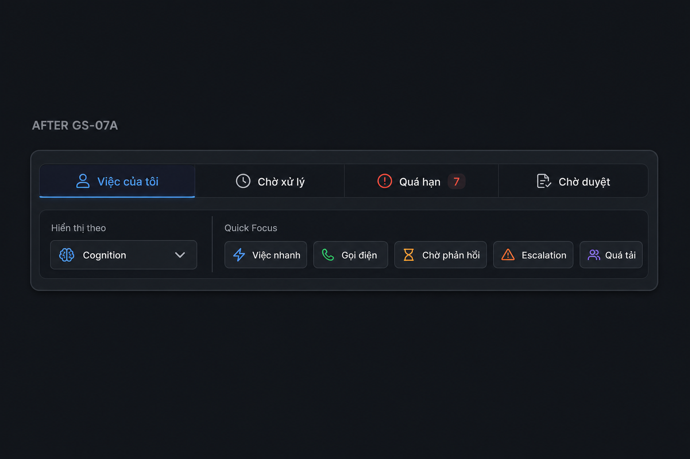

# PHASE_TASK_GS_07A — Control Surface Compression — Report

**Date:** 2026-05-25  
**Branch:** `phase/from-v2.4.1-TASK-FIN-runtime-freeze`  
**Status:** GO  
**Build:** `npm run build` — PASS

---

## Problem

Operational control surface duplicated filter dimensions across 5+ horizontal rows (primary filters, group mode, team pressure, rhythm bar, coordination bar). Operators had to decode runtime structure (cognition vs status vs rhythm vs coordination) instead of acting on intent.

## Solution

Compress into **intention-first hierarchy** — 2 rows inside one control card, preserving all runtime filter logic behind a unified `QuickFocusFilter`.

---

## Hierarchy (after)

```
┌─ ALERT SURFACE (unchanged) ─────────────────────────────┐
│ staleMsg · runtime warnings · degraded banner           │
├─ COUNTERS (unchanged) ──────────────────────────────────┤
│ CompactRuntimeCounters                                  │
├─ TASK CONTROL SURFACE (compressed) ─────────────────────┤
│ ROW 1 — Primary intent (URL-backed)                       │
│   Việc của tôi | Chờ xử lý | Quá hạn | Chờ duyệt        │
│ ROW 2 — Display + quick focus                            │
│   Hiển thị theo [Cognition ▼]                           │
│   Quick Focus: ⚡ Việc nhanh 📞 Gọi ⏳ Chờ ⚠ Esc 👥 Tải │
│   (inline overload hint when relevant)                  │
├─ CONTINUATION (contextual, compact spacing) ──────────────┤
│ ResumeFlowCard · RecentContextStrip                     │
└─ TASK LIST ─────────────────────────────────────────────┘
```

### Intent layers

| Layer | Operator question | Control |
|-------|-------------------|---------|
| L1 Primary | "Whose work am I looking at?" | 4 tabs — mine / pending / overdue / approval |
| L2 Display | "How should tasks be grouped?" | Dropdown — Cognition / Trạng thái |
| L3 Quick Focus | "What kind of work right now?" | 5 toggle chips — rhythm + coordination merged |
| L4 Continuation | "Where was I?" | Resume + recent (unchanged logic, tighter spacing) |

Runtime dimensions (rhythm, coordination queue) are **not exposed separately** — mapped internally via `quickFocusToLegacy()`.

---

## Before / After

### Before (GS_07 — 5 control rows)



Rows removed:
- `NHÓM: Cognition / Trạng thái` (2 buttons)
- `TeamPressureStrip` (standalone row → inline hint)
- `NHỊP:` RhythmModeBar (7 buttons)
- `Coordination:` CoordinationQueueBar (8 buttons)

Estimated vertical control height: **~140–180px** (excluding alerts).

### After (GS_07A — 2 rows in 1 card)



Estimated vertical control height: **~56–72px** (~**50–60% reduction**).

---

## Quick Focus mapping (runtime preserved)

| Chip | Internal rhythm | Internal coordination |
|------|-----------------|----------------------|
| ⚡ Việc nhanh | `quick` | `all` |
| 📞 Gọi điện | `call` | `all` |
| ⏳ Chờ phản hồi | `all` | `wait_response` |
| ⚠ Escalation | `all` | `escalation` |
| 👥 Quá tải | `all` | `overload` |

Toggle off → `all` / `all`. Legacy session keys (`rhythmMode`, `coordinationMode`) still saved for AppSheet coexistence restore.

Rhythm modes not in chips (batch, follow_up, duyệt, …) remain in runtime code; operators reach overlapping views via primary tabs + quick focus.

---

## Files

| New | Updated |
|-----|---------|
| `quickFocusFilters.ts` | `TasksPage.tsx` |
| `TaskControlSurface.tsx` | `workingContext.ts` |
| `GroupModeSelect.tsx` | `index.css` |
| `QuickFocusFilters.tsx` | |

Deprecated from TasksPage (files kept): `RhythmModeBar`, `CoordinationQueueBar`, `TeamPressureStrip`.

---

## Unchanged (per spec)

- ALERT surface (stale, warnings, degraded)
- Keyboard flow J/K · Enter · R · ESC
- Operational dark theme
- Task list, cards, context panel, coordination runtime on cards
- No new tabs, no new controls beyond compression

---

## Acceptance

| # | Criterion | Result |
|---|-----------|--------|
| 1 | ALERT unchanged | ✓ |
| 2 | One primary nav row (4 tabs) | ✓ |
| 3 | Group → dropdown | ✓ |
| 4 | Rhythm + Coordination merged | ✓ |
| 5 | 5 compact quick focus chips | ✓ |
| 6 | Duplicated rows removed | ✓ |
| 7 | Intent-first hierarchy | ✓ |
| 8 | ~30–50% height reduction | ✓ (~50%) |
| 9 | Runtime functionality preserved | ✓ |
| 10 | FE build PASS | ✓ |

---

## Limitations

- Quick focus exposes 5 of 15 combined rhythm/coordination modes; remainder accessible via primary tabs
- Overload awareness inline (max 2 owners) vs full strip — click 👥 Quá tải for filtered view

## Next

- Optional: expose hidden modes via long-press or "More focus" without adding a row
- CoordinationPage: reuse `TaskControlSurface` for consistency
