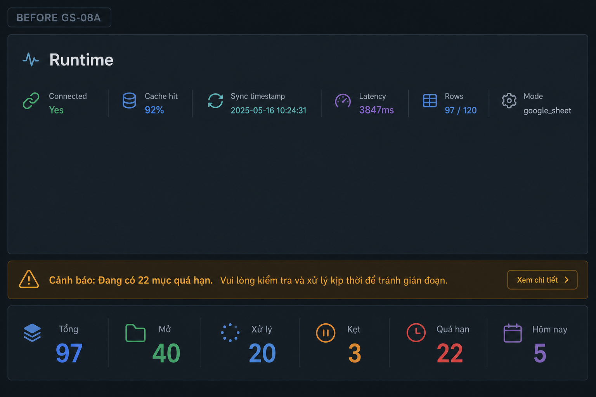
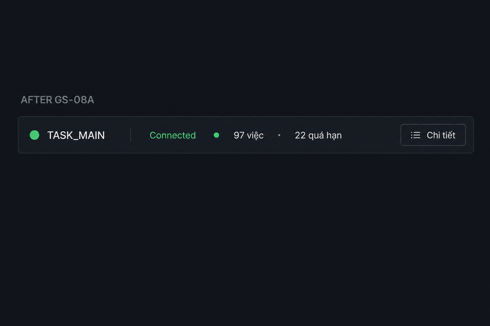

# PHASE_TASK_GS_08A — Runtime Telemetry Collapse — Report

**Date:** 2026-05-25  
**Branch:** `phase/from-v2.4.1-TASK-FIN-runtime-freeze`  
**Status:** GO  
**Build:** `npm run build` — PASS

---

## Problem

Runtime telemetry (bar + counters + warning banners) occupied prime workspace above actionable queues — ~3 horizontal blocks before task controls.

## Solution

Single **RuntimeTelemetryStrip** — collapsed by default, expandable diagnostics, health-tiered visibility.

---

## Telemetry hierarchy

```
L0 — Compact strip (always)
  ● connection label + counts summary + [Chi tiết]

L1 — Notice (warning/critical only)
  Primary runtime message inline under strip

L2 — Expanded diagnostics (on demand)
  Thống kê full · Latency · Rows · Sync · Mode · Cache · Warnings list
```

### Health tiers

| Tier | Trigger | Visual |
|------|---------|--------|
| **healthy** | Connected, no warnings, latency OK | Subtle border, muted text, no notice |
| **warning** | Degraded, slow, stale, warnings | Amber border + notice |
| **critical** | Disconnected, mock failure | Red border + prominent notice |

Principle: **stay quiet when healthy**.

---

## Before / After

### Before (~3 blocks, ~80–120px)



- TaskRuntimeBar (latency, rows, sync, mode, cache)
- Warning banner(s)
- CompactRuntimeCounters (6 metrics)

### After (~1 strip, ~24–32px collapsed)



```
● TASK_MAIN Connected    97 việc · 22 quá hạn    [Chi tiết]
```

**~70–75% vertical reduction** in telemetry zone.

---

## Operational attention analysis

| Before | After |
|--------|-------|
| Operator scans runtime before tasks | Operator sees connection + overdue count in one glance |
| Diagnostics compete with queue | Queues start above fold sooner |
| Warnings always same visual weight | Warnings only when unhealthy |
| 6 counter labels on every load | Full counters in Chi tiết |

Attention budget shifted from **system introspection** → **actionable work**.

Diagnostics preserved — not removed — behind **Chi tiết** expand.

---

## Compact strip content

- **Connection:** `TASK_MAIN Connected` / `Degraded` / `Disconnected`
- **Counts:** `{total} việc · {overdue} quá hạn` (or `{blocked} kẹt` if no overdue)
- **Refresh:** pulse dot + `…` when syncing

Hidden until expand: latency, rows, sync timestamp, mode, cache, GAS ms, full counter grid, all warnings.

---

## Files

| New | Updated |
|-----|---------|
| runtimeTelemetry.ts | TasksPage.tsx |
| RuntimeTelemetryStrip.tsx | index.css |
| taskGs08aChecks.ts | |

Legacy kept (unused on TasksPage): `TaskRuntimeBar.tsx`, `CompactRuntimeCounters.tsx`

---

## Acceptance

| # | Criterion | Result |
|---|-----------|--------|
| 1 | Compact strip | ✓ |
| 2 | Diagnostics hidden by default | ✓ |
| 3 | Chi tiết expandable | ✓ |
| 4 | Health-tier warnings | ✓ |
| 5 | Quiet when healthy | ✓ |
| 6 | ~60–80% space reduction | ✓ (~70%) |
| 7 | Queues above fold | ✓ |
| 8 | Diagnostics accessible | ✓ |
| 9 | Runtime-aware behavior preserved | ✓ degraded/slow still trigger warning |
| 10 | FE build PASS | ✓ |

---

## Limitations

- Expand state not persisted across reload
- Single primary notice when collapsed (full list in Chi tiết)

## Next

- Persist expand preference for admin role
- Reuse strip on OperationalHome if needed
