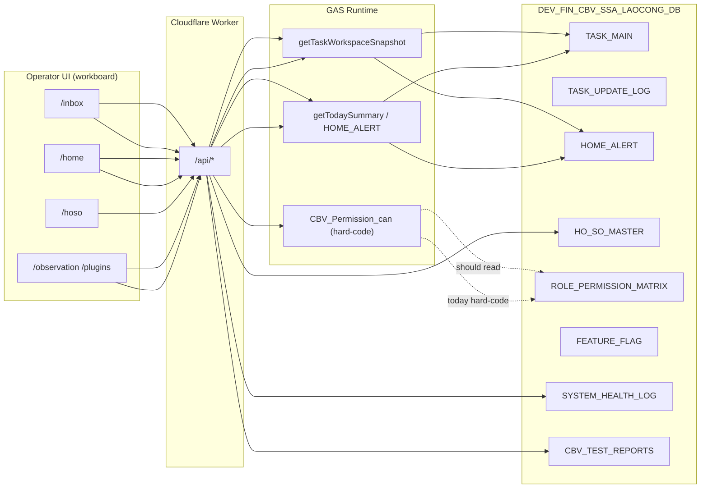

# PHASE UI — DB Design Audit Report

**Date:** 2026-05-30  
**Phase:** `PHASE_UI_DB_DESIGN_AUDIT`  
**Mode:** AUDIT-ONLY — no UI/code changes  
**Standard:** CBV Operational Ecosystem Standard V1  
**DB reference:** `DEV_FIN_CBV_SSA_LAOCONG_DB` (Spreadsheet `1Jh3gQQKugazSvd24CKZremHjSmTNGrsnYczq4UzK5ZE`)  
**FE root:** `apps/workboard/`  
**Type:** Append-only report

---

## Executive Summary

Audit so sánh **operator UI hiện tại** (`apps/workboard`) với **DB/runtime thật** (schema manifest + GAS/Worker binding). Kết luận ngắn:

| Câu hỏi | Trả lời |
|---------|---------|
| UI có phản ánh đúng DB runtime? | **Một phần.** Task read/write bind `TASK_MAIN` + `TASK_UPDATE_LOG` qua Worker; nhưng inbox vẫn derive từ snapshot TASK, **không** đọc trực tiếp `HOME_ALERT` làm nguồn chính. Hồ sơ DB tách `HO_SO_*` nhưng UI chỉ có `/hoso` aggregate. |
| Operator biết việc ưu tiên? | **Chưa đủ rõ.** Hai mô hình song song (V3 inbox groups + legacy cognition/filter tabs) gây nhiễu. |
| Nút lệnh hoạt động thật? | **Một phần.** Quick actions trên list (`Nhận việc`, `Hoàn tất`, …) gọi API khi Worker + real runtime; **Focus Mode V3** vẫn **disabled/stub**. |
| Phân quyền theo DB? | **Không.** `ROLE_PERMISSION_MATRIX` tồn tại trên sheet nhưng FE/GAS dùng ma trận hard-code (`46_CBV_PERMISSION_RUNTIME.js`). |
| Test Console trong menu vận hành? | **Không** — đúng chuẩn. Admin health nằm rải rác `/observation`, `/plugins`, chưa map rõ `CBV_TEST_REPORTS`. |

**Khuyến nghị:** Chuẩn hóa IA theo Work Inbox-first, map rõ sheet → screen, wire nút Focus Mode, đọc permission từ sheet, tách admin khỏi operator.

---

## Audit Method & Sources

| Source | Role in this audit |
|--------|-------------------|
| `DEV_FIN_CBV_SSA_LAOCONG_DB.xlsx` | **Not present in repo.** Sheet list taken from user charter + `05_GAS_RUNTIME/90_BOOTSTRAP_SCHEMA.js`, `06_DATABASE/schema_manifest.json`, `gas-runtime-api/Config.js`. |
| Google Sheet ID `1Jh3gQQKugazSvd24CKZremHjSmTNGrsnYczq4UzK5ZE` | Canonical DB per `PHASE_TASK_GS_01` |
| `apps/workboard/src/app/routes.tsx`, `moduleRegistry.ts`, `TasksPage.tsx` | Current UI truth |
| `PHASE_TASK_PERMISSION_AUDIT_REPORT.md` | Permission + dual-task-source findings |
| `UI_UX/CBV_WORK_INBOX_V3/900_AUTHORITY/` | Target design authority (TO-BE) |
| CBV Standard V1 principles | runtime-first, memory-first, append-only, manual-first → auto-later |

---

## A. Information Architecture — Current vs DB

### A.1 Current menu / routes (AS-IS)

```text
/  → redirect /inbox
/inbox, /tasks      → TaskInboxRoute (TasksPage + WorkInboxShell)
/home               → OperationalHome (launchpad + alerts summary)
/finance            → FinancePage
/hoso               → HoSoPage (single list)
/coordination       → CoordinationPage (ADMIN/MANAGER)
/observation        → ObservationPage
/plugins            → PluginsPage ("Cấu hình mô-đun")
/search             → SearchPage
/m/:moduleSlug      → ModuleRuntimeContainer
```

**OperatorMainSidebar** (khi Work Inbox V3 focus bật):

```text
VẬN HÀNH:  Hôm nay | Việc của tôi | Quá hạn
NGHIỆP VỤ: Hồ sơ | Tài chính | Phối hợp
HỆ THỐNG:  Quan sát → /observe ❌ | Cấu hình → /config ❌
```

**Broken links:** `/observe`, `/config` không có route — thực tế là `/observation`, `/plugins`.

**Module launchpad sidebar** (non-inbox routes): đọc `SYSTEM_REGISTRY`-like qua `LOCAL_MODULE_REGISTRY` + `/api/modules`, không bind sheet `SYSTEM_REGISTRY` trực tiếp trên FE.

### A.2 DB modules vs UI coverage

| DB sheet / module (user charter) | Runtime canonical name | UI screen today | Match? |
|----------------------------------|------------------------|-----------------|--------|
| `HOME_ALERT` | `HOME_ALERT` | `/home` alerts strip + `OperationalAlertHeader` on inbox — **derive từ API today summary**, không phải dedicated HOME_ALERT inbox | ⚠️ Partial |
| `HOME_ALERT_*` (SLA, metrics, config, log) | Same prefix in schema | **Hidden** from operator UI (correct); admin only via GAS/sheet | ✅ Hidden OK |
| `TASK_MAIN` | `TASK_MAIN` | `/inbox`, `/tasks` — primary task list | ✅ |
| `TASKS` | RF12 legacy sheet | **Parallel** path in `gas-runtime-api/` — not GS_01 canonical | ❌ Dual source |
| `TASK_TIMELINE` | RF12 append log | UI timeline = `TASK_UPDATE_LOG` via task detail; RF12 `TASK_TIMELINE` separate | ⚠️ Split |
| `TASK_UPDATE_LOG` | Same | Task detail timeline panel | ✅ |
| `TASK_CHECKLIST`, `TASK_ATTACHMENT` | Same | Detail panel partial / stub in some paths | ⚠️ |
| `HO_SO_XA_VIEN`, `HO_SO_TAI_XE`, `HO_SO_PHUONG_TIEN` | Types in `MASTER_CODE`; data in `HO_SO_MASTER` | Single `/hoso` — no split by hồ sơ type | ❌ |
| `HO_SO_GIAY_TO`, `HO_SO_ATTACHMENT` | `HO_SO_FILE` in manifest | HoSo detail read-only stub | ⚠️ |
| `HO_SO_SEARCH_INDEX` | Search adapter in GAS RF06 | No dedicated search UI (global `/search` is task-centric) | ❌ |
| `ROLE_PERMISSION_MATRIX` | Sheet exists | **Not rendered** — hard-coded matrix | ❌ |
| `FEATURE_FLAG` | Sheet exists | **Not rendered** on workboard | ❌ |
| `SYSTEM_REGISTRY` | Sheet exists | `LOCAL_MODULE_REGISTRY` + API mirror | ⚠️ |
| `CBV_TEST_REPORTS` | Sheet (optional) | Not in operator menu ✅; `/observation` partial | ⚠️ Admin gap |
| `CBV_SYSTEM_HEALTH` / `SYSTEM_HEALTH_LOG` | Code uses `SYSTEM_HEALTH_LOG` | `/observation` mock/summary — not full health dashboard | ⚠️ Naming + depth |
| `API_AUDIT_LOG`, `ADMIN_AUDIT_LOG`, `CBV_AUDIT_LOG`, `CBV_EVENT_*` | Append-only logs | Not exposed in operator UI (correct) | ✅ Hidden |
| `FINANCE_TRANSACTION` | Same | `/finance` | ✅ |

### A.3 Proposed menu (TO-BE) — operator vs admin

**Operator nav (≤5 items — per Design Authority):**

```text
┌─────────────────────────────────────────────────────────────┐
│  CBV Vận hành                                    [User ▾]   │
├──────────┬──────────────────────────────────────────────────┤
│ 📥 Inbox │  (default landing — HOME_ALERT queue + TASK)   │
│ 📋 Việc  │  alias deep-link; merges into Inbox              │
│ 📁 Hồ sơ │  sub: Xã viên | PT | Tài xế (tabs)              │
│ 💰 TC    │  Finance                                       │
│ ⚙️ Admin │  ADMIN only — see below                          │
└──────────┴──────────────────────────────────────────────────┘
```

**Admin sub-menu (role-gated, not in operator default):**

```text
Điều hành (ADMIN)
├── Cảnh báo HOME_ALERT (read + manual resolve)
├── System Health (SYSTEM_HEALTH_LOG + CBV_SYSTEM_HEALTH)
├── Test Console (CBV_TEST_REPORTS) — separate URL, NOT in operator sidebar
├── Phân quyền (ROLE_PERMISSION_MATRIX read-only first)
├── Feature Flag (FEATURE_FLAG read-only first)
└── Audit viewers (API_AUDIT_LOG, CBV_AUDIT_LOG) — append-only read
```

**Test Console:** giữ ngoài menu vận hành; chỉ link từ admin health hoặc bookmark `/admin/test-console` (future).

---

## B. Operator UX Audit

### B.1 First-screen clarity (nhân viên mới)

| Check | Finding |
|-------|---------|
| Biết việc cần làm trước? | **Partial.** V3 KPI strip + groups (Cần làm / Chờ / Theo dõi / Hoàn thành) **when** `WorkInboxGroupsPanel` visible; đồng thời legacy `TaskControlSurface` vẫn hiện cognition grouping + 4 filter tabs → **hai mental model**. |
| OPEN / IN_PROGRESS / RESOLVED / OVERDUE | **Inconsistent labels.** DB `TASK_MAIN.STATUS`: `NEW`, `IN_PROGRESS`, `WAITING`, `DONE`, … UI inbox chips: Quá hạn, Hôm nay, Chờ xử lý, Theo dõi, Hoàn thành. **Không** hiển thị raw OPEN/RESOLVED từ `HOME_ALERT.STATUS`. Overdue derived client-side. |
| CTA rõ | List cards: Nhận việc, Cập nhật, Hoàn tất, Chuyển (via quick actions). Focus V3: **Hoàn thành / Chuyển tiếp / Tạm dừng disabled** with stub tooltip. HoSo: "Chỉ xem". |
| Whitespace / panel depth | Focus runtime 3-region layout improved but still long scroll; legacy detail panel + control strip stack vertically on <xl. Footer runtime drawer adds height. |
| Filter visual state | `task-filter-tab-active` class exists; filter feedback aria-live present. **Good.** Cognition group mode default still confuses operators per authority pack. |

### B.2 UX pain points (prioritized)

| # | Pain | Impact | DB tie-in |
|---|------|--------|-----------|
| P1 | Dual inbox models (V3 groups + legacy cognition tabs) | Operator không biết tin cái nào | TASK_MAIN vs HOME_ALERT priority unclear |
| P2 | Focus actions disabled | Cannot complete work in focus flow | TASK_UPDATE_LOG never written from focus |
| P3 | `/home` vs `/inbox` both claim "Hôm nay" | Split attention | HOME_ALERT not single entry |
| P4 | Hồ sơ gộp một list | Cannot match DB split sheets | HO_SO_* types |
| P5 | Sidebar broken `/observe`, `/config` | 404 for operators | — |
| P6 | Permission không reflect matrix | Wrong buttons visible | ROLE_PERMISSION_MATRIX ignored |
| P7 | Task snapshot may expose all rows | Security + noise | TASK_MAIN + no `canUserSeeTask` on list |
| P8 | Timeline split TASK_UPDATE_LOG vs TASK_TIMELINE | History incomplete in UI | Two append logs |

---

## C. Runtime Mapping (UI ↔ Sheet)

### C.1 Primary mapping table

| UI surface | API / runtime | Primary sheet(s) | Secondary / append-only |
|------------|---------------|------------------|-------------------------|
| `/inbox` list & counts | `GET /api/tasks/workspace-snapshot` | `TASK_MAIN` | `HOME_ALERT` labels merged at read (display fields) |
| `/home` priority cards | `GET /api/today` | `HOME_ALERT` (queue cards) + `TASK_MAIN` summaries | `FINANCE_TRANSACTION`, HoSo missing docs |
| Task detail / timeline | `GET /api/tasks/:id` | `TASK_MAIN` | `TASK_UPDATE_LOG`, `TASK_CHECKLIST`, `TASK_ATTACHMENT` |
| Quick action writes | `POST .../status`, `/assign`, `/complete`, `/comments` | `TASK_MAIN` (update) | `TASK_UPDATE_LOG` append |
| RF12 legacy writes | GAS `gas-runtime-api` | `TASKS` | `TASK_TIMELINE`, `API_AUDIT_LOG` |
| `/hoso` | `GET /api/hoso` | `HO_SO_MASTER` + `HO_SO_FILE` | Not `HO_SO_XA_VIEN` sheet directly |
| `/finance` | `GET /api/finance` | `FINANCE_TRANSACTION` | `FINANCE_LOG` |
| `/coordination` | `GET /api/coordination` | `HOME_ALERT` assignment fields | — |
| `/observation` | `GET /api/observation` | Derived status | `SYSTEM_HEALTH_LOG`, optional `CBV_TEST_REPORTS` |
| `/plugins` | `GET /api/plugins` | Hard-coded capabilities | Should read `FEATURE_FLAG`, `ROLE_PERMISSION_MATRIX` |
| Login / session | `POST /api/auth/login` | `USER_DIRECTORY` | — |
| Module nav | `GET /api/modules` | `SYSTEM_REGISTRY` (when wired) | `LOCAL_MODULE_REGISTRY` fallback |

### C.2 Data flow diagram



### C.3 Status vocabulary gap

| Layer | Status values |
|-------|---------------|
| `HOME_ALERT.STATUS` | OPEN, IN_PROGRESS, RESOLVED, … (operational alert) |
| `TASK_MAIN.STATUS` | NEW, IN_PROGRESS, WAITING, WAITING_APPROVAL, BLOCKED, DONE |
| UI InboxStatus | overdue, today, waiting, follow_up, completed, unknown |
| User expectation | OPEN / IN_PROGRESS / RESOLVED / OVERDUE |

**Proposal:** Single operator-facing map in UI layer (config from `ENUM_DICTIONARY` or `CBV_UI_CONTRACT`), never show raw column names.

---

## D. Permission Design

### D.1 Current state

- FE: `modulePermissions.ts` + `PermissionGate` + `user.permissions[]` from API.
- GAS: `46_CBV_PERMISSION_RUNTIME.js` — `CBV_PERMISSION_ROLE_MATRIX` **hard-coded**.
- Sheet `ROLE_PERMISSION_MATRIX`: **not consumed** at runtime (confirmed in `PHASE_TASK_PERMISSION_AUDIT_REPORT.md`).
- Role names in FE: `ADMIN`, `MANAGER`, `STAFF`, `FINANCE`, `HO_SO`, `VIEW_ONLY` — not `ADMIN` / `OPERATOR` / `USER`.
- Legacy map: `OPERATOR → STAFF`.

### D.2 Proposed rule model (map to sheet)

| Persona | Maps from `USER_DIRECTORY` | Capabilities |
|---------|---------------------------|--------------|
| **ADMIN** | `IS_ADMIN` or `ROLE=ADMIN` | All view, config, permission read, feature flag read, test console, audit viewers |
| **OPERATOR** | `IS_OPERATOR` or `ROLE_CODE=OPERATOR` | View assigned/open queue, claim, update status, complete, comment, handoff — **no** config |
| **USER** | Default staff / reporter | View related tasks (owner/reporter/shared/public), add info/comments — **no** assign/config |

**Implementation rule:** FE buttons call `canExecute(ACTION_CODE)` from Worker; Worker reads **cached** `ROLE_PERMISSION_MATRIX` rows where `STATUS=ACTIVE` and `IS_DELETED` blank. No duplicate matrix in TS/JS after migration.

### D.3 Permission gaps (UI-specific)

| Gap | Risk |
|-----|------|
| Snapshot returns all `TASK_MAIN` rows | User sees tasks they should not |
| `permissionAllowed` on TaskItem unused for filtering | UI-only false sense of security |
| `/plugins` visible to MANAGER/VIEW_ONLY | Over-exposure of config surface |
| HoSo "Chỉ xem" with no approval path | `CAN_APPROVE` in matrix unused |
| Focus complete disabled for all roles | Operators forced back to list for writes |

---

## E. Button / Runtime Action Gaps

| Button / CTA | UI location | Wired to API? | Target sheet / action |
|--------------|-------------|---------------|------------------------|
| Nhận việc | Task card quick action | ✅ `updateTaskStatus(IN_PROGRESS)` | TASK_MAIN + TASK_UPDATE_LOG |
| Hoàn tất | Task card quick action | ✅ `completeTask` | TASK_MAIN + TASK_UPDATE_LOG |
| Chuyển / Handoff | Quick action + inline | ⚠️ Partial (`assignTask`) | TASK_MAIN |
| Ghi chú | Task update form | ✅ `addTaskComment` | TASK_UPDATE_LOG |
| Cập nhật trạng thái | TaskUpdateForm | ✅ | TASK_MAIN |
| Mở hồ sơ | Deep link | ⚠️ Stub / navigate `/hoso` without id | HO_SO_MASTER |
| Hoàn thành (Focus V3) | WorkInboxFocusModeV3 | ❌ **disabled stub** | Should → `completeTask` |
| Chuyển tiếp (Focus V3) | WorkInboxFocusModeV3 | ❌ **disabled stub** | Should → `assignTask` |
| Tạm dừng (Focus V3) | WorkInboxFocusModeV3 | ❌ **disabled stub** | Should → `updateTaskStatus(WAITING)` |
| Nhận việc (HOME_ALERT claim) | Not exposed | ❌ | HOME_ALERT `CLAIMED_BY` |
| Resolve alert | Not on FE | ❌ | HOME_ALERT `IS_RESOLVED` |
| Tạo việc | TaskCreateModal | ✅ when capability allows | TASK_MAIN |
| Phối hợp assign | CoordinationPage | ⚠️ Read-heavy | HOME_ALERT assignment |

---

## F. Proposed Screen Updates (text wireframes)

### F.1 Home / Work Inbox (merged operator entry)

```text
┌─ Header: Cảnh báo vận hành ──────────────────── [Làm mới] ─┐
│ 🔴 3 quá hạn  🟡 5 chờ nhận  🟢 12 đang xử lý  (from HOME_ALERT KPI) │
├─ Inbox groups ─────────────────────────────────────────────┤
│ 🔥 Cần làm ngay (4)     [card][card][card]                  │
│ 🟡 Chờ xử lý (7)        [card]...                           │
│ 👀 Theo dõi (2)                                             │
│ ✅ Hoàn thành (collapsed)                                     │
├─ Focus bar (optional) ──────────────────────────────────────┤
│ ▶ Việc 2/4: "Xác minh GPLX"  [Hoàn thành][Chuyển][Tạm dừng]│
└─────────────────────────────────────────────────────────────┘
Footer: sync time · TASK_MAIN · cache hit · role: OPERATOR
```

**Changes vs today:** Drop cognition default; single scroll; HOME_ALERT counts in header; `/` = this screen only.

### F.2 Task Detail Drawer

```text
┌─ Task: Xác minh GPLX ──────────────── STATUS: Đang làm ─┐
│ Owner: Nguyễn A · Due: 30/05 · Quá hạn: Không            │
│ [Nhận việc] [Cập nhật] [Hoàn tất] [Chuyển] [Ghi chú]     │
├─ Timeline (TASK_UPDATE_LOG append-only) ───────────────────┤
│ 10:02 — Nhận việc — Nguyễn A                             │
│ 09:15 — Tạo việc — System                                │
├─ Liên kết ────────────────────────────────────────────────┤
│ [Mở hồ sơ xã viên] [Mở phương tiện] [Tài liệu]           │
└───────────────────────────────────────────────────────────┘
```

### F.3 Hồ sơ Detail

```text
┌─ Hồ sơ xã viên: Trần B ──────────────────────────────────┐
│ Tabs: [Xã viên] [Phương tiện] [Tài xế] [Giấy tờ]          │
│ Status: Thiếu GPLX · 75% hoàn thiện                      │
│ [Mở task liên quan] [Xem file] (manual approve → log)     │
├─ Giấy tờ (HO_SO_FILE) ─────────────────────────────────────┤
│ CCCD ✅ · GPLX ❌ · ĐK xe ⚠️                               │
└───────────────────────────────────────────────────────────┘
```

### F.4 Test Console (admin only)

```text
URL: /admin/test-console (NOT in operator sidebar)
┌─ CBV Test Console ─────────────────────────────────────────┐
│ Phase: [GS_01 ▾]  [Chạy thủ công]  (no auto-run)          │
│ Kết quả ← CBV_TEST_REPORTS (append-only rows)             │
│ [Xem báo cáo] [Export]                                    │
└───────────────────────────────────────────────────────────┘
```

### F.5 System Health

```text
┌─ System Health ────────────────────────────────────────────┐
│ Cards: TASK API · HOME_ALERT sync · Worker · GAS         │
│ Source: SYSTEM_HEALTH_LOG + CBV_SYSTEM_HEALTH (if present) │
│ ⚠ CBV_TEST_REPORTS missing (warning only)                │
└───────────────────────────────────────────────────────────┘
```

### F.6 Permission / Feature Flag admin

```text
┌─ Phân quyền (read-only v1) ────────────────────────────────┐
│ Filter: ROLE_CODE [OPERATOR ▾]  MODULE [TASK ▾]           │
│ Table ← ROLE_PERMISSION_MATRIX                            │
│ CAN_VIEW | CAN_ASSIGN | CAN_RESOLVE | ...                 │
├─ Feature Flag ────────────────────────────────────────────┤
│ FEATURE_CODE | ENABLED | ROLLOUT_SCOPE                    │
│ (read-only v1; edit = phase 2 + ADMIN_AUDIT_LOG)          │
└───────────────────────────────────────────────────────────┘
```

---

## G. Implementation Phases (no code in this phase)

### Phase 1 — IA & route fix (low risk)

- Fix sidebar links `/observe` → `/observation`, `/config` → `/plugins` or new `/admin`.
- Confirm `/inbox` default; deprecate cognition default → `status` or V3 groups only.
- Document sheet → route in `CBV_UI_CONTRACT` rows.

### Phase 2 — Runtime alignment

- Inbox header KPI from `HOME_ALERT` API (not only TASK snapshot).
- Wire Focus V3 actions to existing `useInlineExecution`.
- Task list server-side filter: `canUserSeeTask` per row.
- Deprecate RF12 `TASKS` path for operator UI (single canonical `TASK_MAIN`).

### Phase 3 — Hồ sơ split & deep links

- Tabs by `HO_SO_TYPE_ID` / MASTER_CODE (`HO_SO_XA_VIEN`, …).
- Task ↔ HoSo deep links via `RELATED_ENTITY_*`.

### Phase 4 — Permission & feature flag from sheet

- Worker endpoint `GET /api/permissions/effective`.
- FE `PermissionGate` uses ACTION_CODE from matrix.
- Map OPERATOR/USER personas in login payload.

### Phase 5 — Admin surfaces

- `/admin/health`, `/admin/permissions`, `/admin/test-console` (separate shell).
- Read-only append viewers for audit sheets.

---

## H. Risk List

| Risk | Severity | Mitigation |
|------|----------|------------|
| Dual task sources (`TASK_MAIN` vs `TASKS`) | HIGH | ADR: single canonical; RF12 read-only until migrated |
| Permission matrix migration breaks existing roles | HIGH | Shadow-read sheet vs hard-code; diff report before switch |
| HOME_ALERT / TASK desync | MEDIUM | Show source badge on cards during transition |
| Excel export newer than manifest | MEDIUM | Run `taskDbBuildSchemaReport_()` on live sheet; append diff report |
| Focus wiring causes accidental writes | MEDIUM | Manual-first: confirm dialog + append-only log |
| Admin pages in operator nav | LOW | Role gate + separate layout |

---

## I. Acceptance Check (this phase)

- [x] Report identifies UI ↔ DB mismatches with sheet names
- [x] Proposed menu diagram included
- [x] Button/runtime action gap list included
- [x] Operator layout compression proposals included
- [x] Phased implementation plan included
- [x] No UI/code changes in this phase
- [x] Append-only report (new file)

---

## J. Next Cursor Prompt for Implementation

Save as `00_SYSTEM_BRAIN/000_PROMPTS/PHASE_UI_DB_DESIGN_IMPLEMENTATION_01_IA_AND_FOCUS_ACTIONS_PROMPT.md` when ready:

```text
READ FIRST:
- 00_SYSTEM_BRAIN/000_REPORTS/PHASE_UI_DB_DESIGN_AUDIT_REPORT.md
- UI_UX/CBV_WORK_INBOX_V3/900_AUTHORITY/000_DESIGN_AUTHORITY.md
- CBV Operational Ecosystem Standard V1

PHASE: PHASE_UI_DB_DESIGN_IMPLEMENTATION_01
SCOPE: IA fixes + Focus V3 action wiring ONLY (no permission matrix migration yet)

TASKS:
1. Fix OperatorMainSidebar routes (/observation, /admin or /plugins).
2. Wire WorkInboxFocusModeV3 Hoàn thành/Chuyển tiếp/Tạm dừng → useInlineExecution (same as TasksPage).
3. Hide legacy TaskControlSurface cognition default when WorkInboxGroupsPanel active.
4. Add HOME_ALERT KPI strip to inbox header via existing getTodaySummary (document mapping).
5. npm run build + existing inbox checks PASS.

OUT OF SCOPE: ROLE_PERMISSION_MATRIX reader, HO_SO tab split, Test Console UI.

OUTPUT: append report PHASE_UI_DB_DESIGN_IMPLEMENTATION_01_REPORT.md + handoff.
DO NOT overwrite this audit report.
```

---

## References

- `PHASE_TASK_PERMISSION_AUDIT_REPORT.md`
- `PHASE_TASK_GS_01_RATE_LIMIT_SAFE_EXISTING_DB_BINDING_REPORT.md`
- `PHASE_UI_CBV_WORK_INBOX_V3_AUTHORITY_PACK_REPORT.md`
- `docs/ui-contract/PILOT_SCREEN_MATRIX.md`
- `05_GAS_RUNTIME/90_BOOTSTRAP_SCHEMA.js`
- `apps/workboard/src/app/routes.tsx`

---

*Append-only — PHASE_UI_DB_DESIGN_AUDIT — 2026-05-30*
