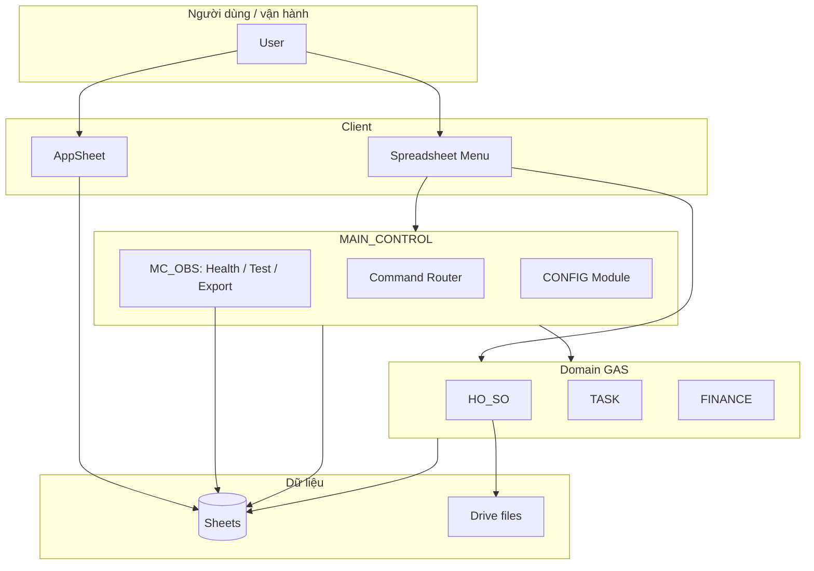

# ARCHITECTURE_OVERVIEW — CBV_SSA_LAOCONG_PRO

**Ngày:** 2026-05-11

---

## 1. System layers (từ ngoài vào trong)

| Lớp | Nội dung trong repo | Ghi chú |
|-----|---------------------|---------|
| **Presentation** | `04_APPSHEET/` | Slice, security filter, UX — không thay thế GAS business. |
| **API / WebApp** | `apps-script/main-control/src/200_MAIN_CONTROL_WEBAPP.js`, `apps-script/hoso/src/200_HOSO_V2_WEBAPP.js` | Gateway tùy cấu hình triển khai. |
| **Application / Control plane** | `apps-script/main-control/` | Bootstrap, command router, permission, registry, CONFIG, Level-6, **MC_OBS**. |
| **Domain services** | `apps-script/hoso/`, `apps-script/task/`, `apps-script/finance/`, mirror `05_GAS_RUNTIME/*` | HO_SO canonical; TASK/FINANCE phụ thuộc core khi tách project. |
| **Core / Infrastructure** | `apps-script/core-runtime-lib/`, phần core copy trong main-control | Event bus/worker, sheets, audit, health, OBS core B1. |
| **Persistence** | Quy ước trong `06_DATABASE/`, `01_SCHEMA/` | Google Sheets + Drive; CSV schema generated. |
| **Observability** | `ADMIN_AUDIT_LOG`, MC_OBS sheets, `09_AUDIT/` | Audit + test run + findings + AI export. |
| **Knowledge / Brain** | `00_SYSTEM_BRAIN/`, `docs/`, `03_SHARED/` | Không runtime — điều phối người–AI. |

---

## 2. Domain modules

- **HO_SO:** hồ sơ, file, quan hệ, in ấn — `02_MODULES/HO_SO/`, `apps-script/hoso/`.
- **TASK:** TASK_MAIN, checklist, log, visibility — `02_MODULES/TASK_CENTER/`, `apps-script/task/`, `05_GAS_RUNTIME` task files.
- **FINANCE:** giao dịch, workflow — `02_MODULES/FINANCE/`, `apps-script/finance/`.
- **INVOICE (member pipeline):** **không** có module `apps-script` trong repo; chỉ enum kiểu attachment / repo ngoài trong inventory.

---

## 3. Runtime modules

```text
CBV_SSA_LAOCONG_PRO
├── 05_GAS_RUNTIME/          # Monolith mirror (full surface)
├── apps-script/
│   ├── main-control/        # Orchestrator + OBS + menus tổng
│   ├── core-runtime-lib/    # Shared runtime + CBV_OBS_CORE (B1)
│   ├── hoso/                # HO_SO V2 clasp project
│   ├── task/                # TASK clasp project (OBS adapter + business)
│   └── finance/             # FINANCE clasp project
└── 07_TEST/                 # Runners & docs (một phần copy sang GAS khi deploy)
```

---

## 4. Test Console layer

- **Thực tế:** test nằm trong menu **CBV PRO** (monolith), **MAIN_CONTROL OBS** (🧪 Health / Self-Test), **Level 6**, **HO_SO** tests, file `99_DEBUG_*` theo module — **chưa** gom một **🧪 CBV Test Console** top-level duy nhất.
- **Tài liệu chuẩn mong muốn:** `07_TEST/README.md`, `00_SYSTEM_BRAIN/README.md` (repo-audit).

---

## 5. Report layer

- **Append-only trên sheet:** MC_OBS writer (`302_MC_OBS_WRITER.js`) + schema `300_MC_OBS_SCHEMA.js`.
- **Static audit:** `09_AUDIT/`, `docs/`.
- **AI handoff output:** Drive file + hàng `AI_EXPORT` (từ `305_MC_OBS_AI_EXPORT.js`).

---

## 6. Prompt / Brain layer

- `00_SYSTEM_BRAIN/AI_HANDOFF.md` → package đầy đủ.
- `.cursor/rules/*.mdc` — quy tắc agent (TASK_MAIN PRO, naming).
- `00_inbox/obs_prompt_template.md` — template prompt OBS theo module.

---

## 7. AI handoff layer

| Cơ chế | Vị trí |
|--------|--------|
| Tóm tắt & backlog | `AI_HANDOFF_PACKAGE/*.md` |
| Export chẩn đoán | `MC_Obs_generateAiDiagnosticExport` |
| Handoff finance | `_handoff/CLAUDE_FINANCE_PACK/` |

**Biên giới:** AI **không** tự chọn runtime; vận hành qua menu/hàm explicit và export JSON do người vận hành kích hoạt.

---

## 8. Manual-first / semi-auto / auto

| Vùng | Hành vi điển hình |
|------|-------------------|
| **Manual-first** | Bootstrap, migration, repair zone, enum seed — luôn qua menu/hàm tên rõ. |
| **Semi-auto** | Event worker, trigger matrix — chạy theo lịch nhưng logic bounded; cần cấu hình. |
| **Auto (hạn chế)** | On-edit / webhook — có idempotency + trace ở một số đường; không “AI tự quyết định”. |

---

## 9. Sơ đồ Mermaid — luồng điều phối



---

## 10. Kết luận kiến trúc

Hệ là **modular monolith đang tách clasp**, với **control plane** (MAIN_CONTROL) mạnh hơn domain satellite (task/finance) về observability. Điểm nghẽn kiến trúc hiện tại là **chuẩn hóa test console + report contract** xuyên suốt, và **hoàn tất binding** cho TASK clasp.
