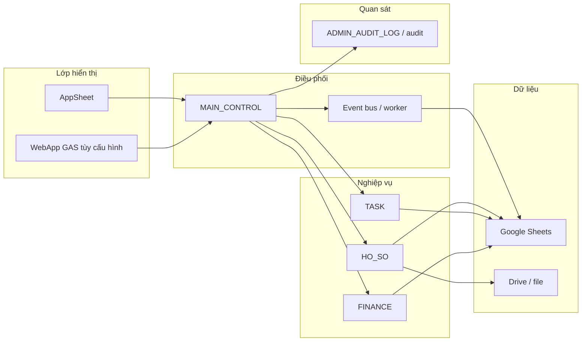

# SYSTEM MAP — CBV_SSA_LAOCONG_PRO & hệ anh em

**Phạm vi:** bản đồ **kiến trúc nghiệp vụ + runtime** lấy từ tài liệu trong repo `CBV_SSA_LAOCONG_PRO`. Quan hệ với repo khác dưới `D:\Workspace\projects` ghi **CHƯA_XÁC_MINH** nếu chưa đối chiếu từng deployment.

**Ngày:** 2026-05-11

---

## 1. Module chính (trong `CBV_SSA_LAOCONG_PRO`)

| Mã | Vị trí / vai trò | Mô tả ngắn |
|----|------------------|------------|
| **META / Governance** | `00_META/`, `00_OVERVIEW/` | Chuẩn log, hierarchy, contract service. |
| **HO_SO** | `02_MODULES/HO_SO/`, `apps-script/hoso/`, `05_GAS_RUNTIME/*HOSO*` | Hồ sơ, file, quan hệ; service canonical `hoso*`. |
| **TASK** | `02_MODULES/TASK_CENTER/`, `apps-script/task/`, `05_GAS_RUNTIME/*TASK*` | TASK_MAIN, checklist, log; visibility SHARED_WITH / IS_PRIVATE (baseline PRO). |
| **FINANCE** | `02_MODULES/FINANCE/`, `apps-script/finance/`, `05_GAS_RUNTIME/*FINANCE*` | Giao dịch, workflow xác nhận. |
| **MAIN_CONTROL** | `apps-script/main-control/` | Điều phối, bootstrap, menu, Level-6 hardening, config resolver. |
| **CORE_RUNTIME_LIB** | `apps-script/core-runtime-lib/` | Thư viện event/worker/sheet dùng chung (clasp project riêng). |
| **AppSheet spec** | `04_APPSHEET/` | UX, slice, security filter, binding — **không** chứa business logic thay GAS. |
| **Database / schema** | `06_DATABASE/`, `01_SCHEMA/` | Manifest, CSV schema, seed. |
| **Automation** | `07_AUTOMATION/` | Trigger matrix. |
| **Audit / test** | `09_AUDIT/`, `07_TEST/` | Báo cáo audit, template regression, `CBV_TEST_RUNNER.js`. |
| **GAS monolith (mirror)** | `05_GAS_RUNTIME/` | Bản “đầy đủ” để copy / đối chiếu; clasp đa project tách trong `apps-script/`. |

---

## 2. Quan hệ giữa module

Tham chiếu văn bản: `03_SHARED/MODULE_MAP_MASTER.md`, `docs/MODULE_BOUNDARY.md`.

---

## 3. Phân loại theo vai trò

| Vai trò | Module |
|---------|--------|
| **Core** | MAIN_CONTROL, `05_GAS_RUNTIME` core (bootstrap, permission, health), ENUM / MASTER_CODE, event types. |
| **Frontend (ứng dụng người dùng)** | AppSheet (spec trong `04_APPSHEET/`); WebApp **CHƯA_XÁC_MINH** theo từng triển khai. |
| **Frontend (modern web)** | **Không** nằm trong repo này; có thể ở `LAOCONG_VOS_PLATFORM`, `CBV_FE`, v.v. (inventory). |
| **Database** | Google Sheets (logical DB) + file Drive; **Supabase** không phải DB chính của pack PRO này. |
| **Test / audit** | `07_TEST/`, `09_AUDIT/`, menu smoke/audit trong GAS. |

---

## 4. Luồng dữ liệu tổng quát

| Bước | Thành phần | Ghi chú |
|------|------------|---------|
| 1 | **User** | Nhân viên / admin / xã viên (tùy slice). |
| 2 | **WebApp / AppSheet / Frontend** | AppSheet là frontend chính theo README repo; React/Vercel ở repo khác nếu có. |
| 3 | **Service** | GAS: `hoso*`, `task*`, `finance*`, router/bootstrap trong MAIN_CONTROL. |
| 4 | **Queue** | Time-driven / event worker (`core-runtime-lib`, `07_AUTOMATION/TRIGGER_MATRIX.md`) — **không** phải Redis queue cổ điển trừ khi tích hợp ngoài. |
| 5 | **Worker** | `*EVENT*WORKER*`, trigger handlers — xử lý bất đồng bộ nhẹ trong GAS. |
| 6 | **DB** | Sheets (`TASK_MAIN`, `HO_SO_MASTER`, …). |
| 7 | **Audit** | `ADMIN_AUDIT_LOG`, audit helpers, báo cáo trong `09_AUDIT/`. |
| 8 | **Report** | AppSheet view / export / báo cáo GAS tùy cấu hình. |

Luồng tài liệu gốc: `03_SHARED/SYSTEM_DATA_FLOW_MASTER.md`.

---

## 5. Repo ngoài `CBV_SSA_LAOCONG_PRO` (chỉ vị trí trên disk)

| Repo | Vai trò ước lượng |
|------|-------------------|
| `LAOCONG_VOS_PLATFORM` | Web + tooling hiện đại; có thể DB Supabase trong phase. |
| `CBV_SSA_LAOCONG_VOS` | Biến thể VOS + Apps Script. |
| Hàng chục repo `CBV_*` / invoice / intake | LAB/PILOT theo từng đề tài; **CHƯA_XÁC_MINH** mapping nghiệp vụ từng cái. |

Chi tiết đường dẫn: `REPO_INVENTORY.md`.
