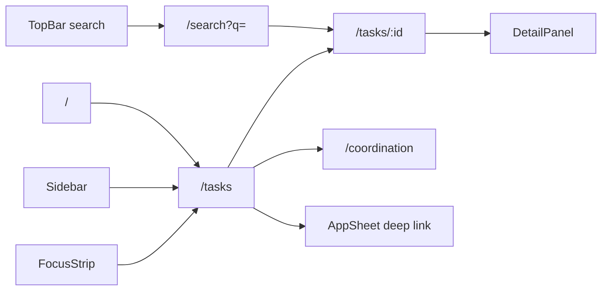

# CBV_WORK_INBOX_V3 — Information Architecture

**Version:** V3.0 · **Date:** 2026-05-29

---

## 1. IA overview

```
CBV Operational Workspace (WebApp)
├── Home / Launchpad          /
├── Work Inbox (PRIMARY)        /tasks, /tasks/:taskId
├── Search                      /search?q=
├── Coordination                /coordination
├── Finance                     /finance
├── Hồ sơ                       /hoso
├── Observation                 /observation
├── Plugins                     /plugins
└── Module runtime              /m/:moduleSlug
```

**Work Inbox** = Task Workspace at `/tasks`. It is the default operational destination after login for operator roles.

---

## 2. Information layers (top → bottom)

| Layer | Content | Mutability |
|-------|---------|------------|
| **L0 — Shell chrome** | TopBar, Sidebar, RuntimeStatusBar | Nav + session only |
| **L1 — Attention** | OperationalAlertHeader, FocusStrip (non-task routes) | Read-only signals |
| **L2 — Control surface** | Filter tabs, group mode, quick focus, focus queue toggle | Client state → URL sync |
| **L3 — Queue** | Grouped task cards (cognition or status grouping) | Read from snapshot |
| **L4 — Context panel** | DetailPanel (right): SLA, timeline, files, next step | Read + inline exec |
| **L5 — Footer telemetry** | RuntimeStatusBar counters, stale hints | Read-only |

---

## 3. Data sources

| Entity | API / snapshot field | UI use |
|--------|---------------------|--------|
| Task list | `TaskWorkspaceSnapshot.tasks`, `blockedTasks`, `dueTasks`, `overdueTasks` | Queue rendering |
| Task detail | `TaskDetail` via `/tasks/:taskId` or panel fetch | DetailPanel |
| User directory | `snapshot.usersById` | Display names, capabilities |
| Runtime identity | `RuntimeUser` from session + directory | Action gating, landing defaults |
| Working context | `localStorage` / session (`workingContext.ts`) | Group mode, quick focus restore |
| Focus queue | `sessionStorage` (`cbv_focus_queue_mode`) | Focus mode toggle |
| Execution memory | In-memory + session strip | Resume flow chips |
| Telemetry | `TaskRuntimeTelemetryContext` | Status bar metrics |

---

## 4. Task information model (card)

Each `TaskItem` surfaces through derived runtime (`deriveVisibleTaskRuntime`):

| Field group | Fields | Card visibility |
|-------------|--------|-----------------|
| Identity | `taskId`, `title` | Always — title is primary scan anchor |
| Status | `status`, `priority` | Compact line or badge |
| People | `owner`, `reporter` (UserRef) | Compact line — displayName only |
| Urgency | `urgency.*` (blocked, overdue, waiting, stale, escalation) | Dominant signal (one) |
| Timing | `dueDate`, `updatedAt` | Compact line |
| Action hint | `nextAction` / `getTaskNextAction()` | Action zone + detail |
| Signals collapsed | Secondary urgency labels | Tooltip / detail only |

---

## 5. Filter & grouping taxonomy

### Primary filters (URL: `?filter=`)

| Key | Label | Semantics |
|-----|-------|-----------|
| `mine` | Việc của tôi | Owner or reporter = current user |
| `pending` | Chờ xử lý | Actionable non-terminal states |
| `overdue` | Quá hạn | Past due, not done |
| `approval` | Chờ duyệt | Awaiting approval |

Default: `mine`.

### Group modes (URL: `?group=`)

| Key | Label | Behavior |
|-----|-------|----------|
| `cognition` | (default) | Operator-oriented buckets (urgency/action) |
| `status` | Trạng thái | Group by workflow status |

### Quick focus (session memory, not URL)

| Value | Purpose |
|-------|---------|
| `all` | No quick-focus narrowing |
| `actionable` | Tasks needing operator action |
| `blocked` | Blocked subset |
| `team` | Team/supervisor view |
| `resume` | Resume interrupted flow |

---

## 6. Navigation relationships



---

## 7. Cross-module links (read-only from inbox)

| Signal | Target |
|--------|--------|
| Overdue count (FocusStrip) | `/tasks?filter=overdue` |
| Unassigned (FocusStrip) | `/coordination` |
| Finance pending | `/finance` |
| Missing GPLX | `/hoso` |

Work Inbox does not embed these modules — it links out.

---

## 8. Content priority (detail panel)

Order enforced by GS_09H rebalance:

1. Next action / execution prompt
2. Inline quick actions (if permitted)
3. SLA / urgency summary
4. Owner / reporter / dates
5. Timeline / micro-updates
6. Files / attachments
7. Debug / raw fields (admin only, collapsed)

---

## 9. Empty & error states

| Condition | Surface |
|-----------|---------|
| Initial load | `TaskListSkeleton` |
| API fail | `ErrorState` + retry |
| Filter yields zero | `EmptyState` with filter-specific copy |
| Stale snapshot | Banner in OperationalAlertHeader + status bar hint |
| Degraded runtime | Keep last snapshot; `GO_WITH_WARNINGS` messaging |

---

## 10. IA constraints for implementers

- Do not add new primary filter keys without GAS/runtime alignment.
- URL is shareable state for filter + group; quick focus and focus queue remain session-local unless explicitly promoted to URL in a future phase.
- `usersById` must hydrate before first card render when snapshot includes directory.
