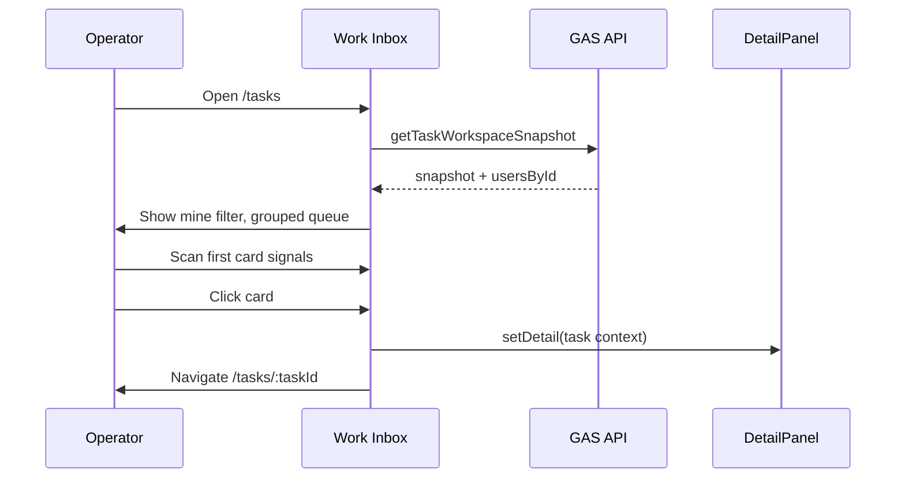

# CBV_WORK_INBOX_V3 — User Flow

**Version:** V3.0 · **Date:** 2026-05-29

---

## 1. Primary personas

| Persona | Runtime mode | Default landing |
|---------|--------------|-----------------|
| Operator (STAFF) | `operator` | `/tasks?filter=mine` |
| Supervisor (MANAGER) | `supervisor` | `/tasks?filter=pending` + quick focus `team` |
| Admin | `admin` | `/tasks` (all filters) |
| Viewer (VIEW_ONLY) | `viewer` | `/tasks` read-only, no inline exec |

Landing defaults from `getIdentityLandingDefaults()`.

---

## 2. Flow A — Morning scan (operator)

**Success criteria:** Operator identifies top actionable task within 3 seconds of load.

---

## 3. Flow B — Filter switch

1. Operator clicks filter tab (e.g. Quá hạn)
2. `onFilterChange` → update URL `?filter=overdue`
3. `deriveVisibleTaskRuntime` recomputes visible set
4. Filter feedback message (optional, 2s toast in control strip)
5. Selection resets or preserves pinned task if still visible

**Memory:** Filter not in working context by default — URL is source of truth.

---

## 4. Flow C — Inline accept / complete

1. Operator clicks primary action on card (e.g. Nhận xử lý)
2. Card enters `task-card-pending-exec`
3. API write via `useInlineExecution`
4. On success: patch snapshot, success feedback, record execution memory
5. On fail: `RuntimeFeedbackMessage` with retry, card exits pending

**Guard:** `canPerformInlineAction(actionId, runtimeUser)` must pass.

Viewer role → actions hidden, AppSheet link only.

---

## 5. Flow D — Focus queue mode

1. Operator toggles Focus queue in TaskControlSurface
2. `saveFocusQueueMode(true)` → sessionStorage
3. Control strip compresses (`operational-control-focus`)
4. Non-selected cards dim (`task-card-dimmed`)
5. Selected/focused card stays full signal
6. Toggle off restores full queue view

**Intent:** Reduce noise during single-task execution without leaving inbox.

---

## 6. Flow E — Quick focus

1. Operator selects quick focus chip (actionable / blocked / team / resume)
2. `saveTaskWorkingContext({ quickFocus })`
3. Queue narrows client-side on snapshot
4. Combines with active filter (intersection, not replacement)

---

## 7. Flow F — Resume interrupted task

1. Execution memory or resume snapshot detects interrupted task
2. Context chip appears in control strip
3. Operator clicks resume chip
4. Navigate to `/tasks/:taskId`, select card, open detail
5. `recordResumeFlow()` observation

---

## 8. Flow G — Search → task

1. Operator enters query in TopBar
2. Navigate `/search?q=...`
3. API search returns cross-module results
4. Click TASK result → `/tasks/:id`
5. Detail panel opens with task context

---

## 9. Flow H — Handoff / micro-update

1. Operator opens detail or inline strip
2. Select handoff target or micro-update option
3. Confirm (manual)
4. API append update
5. Snapshot refresh (soft)
6. HandoffChain shows append-only chain (read)

No silent handoff — always explicit confirm step.

---

## 10. Flow I — Degraded runtime

1. API returns `GO_WITH_WARNINGS` or stale snapshot
2. OperationalAlertHeader shows banner
3. RuntimeStatusBar shows stale hint
4. Queue keeps last good data
5. Background soft refresh attempts
6. Operator may manually refresh via status bar action

**Never** blank the queue on degraded response if snapshot exists.

---

## 11. Flow J — AppSheet escape hatch

When inline exec locked or `ExecutionMode = NOT_CONFIGURED`:

1. Detail shows AppSheet deep link button
2. Operator opens AppSheet in new tab
3. WebApp remains on task (read-first)
4. Return via browser tab — optional soft refresh

---

## 12. Error flows

| Error | Operator sees | Recovery |
|-------|---------------|----------|
| Network fail | ErrorState + retry | Click retry |
| Empty filter | EmptyState with guidance | Change filter |
| Permission denied | Action hidden + tooltip | Contact admin |
| Unknown task id | Error in detail | Return to list |
| Logout mid-action | Session cleared | Re-login |

---

## 13. Flow constraints

- No auto-navigation to next task after complete (unless operator clicks next/resume)
- No modal chains deeper than 1 level for standard actions
- All write flows must show pending state before success/fail
- URL must remain shareable for filter/group/task id
