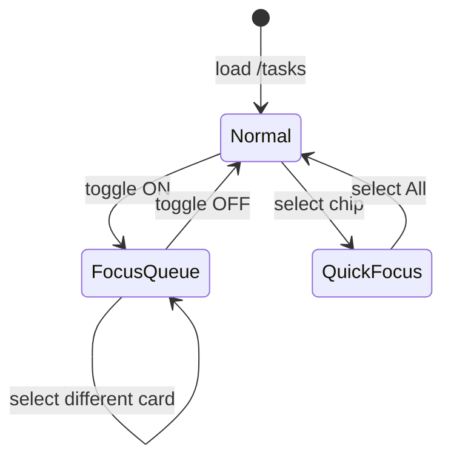

# Wireframe — Focus Mode

**Applies to:** Focus Queue Mode + Quick Focus · All breakpoints

---

## 1. Normal mode vs Focus Queue Mode

### Normal (focusQueueMode = false)

```
┌─ TaskControlSurface ──────────────────────────────────────────────┐
│ [Việc của tôi][Chờ xử lý][Quá hạn][Chờ duyệt] | [Grp] [QF chips] │
│ (resume · recent · exec memory chips)                              │
└────────────────────────────────────────────────────────────────────┘

Cards: full opacity, all signals visible per priority model
```

### Focus Queue Mode (focusQueueMode = true)

```
┌─ TaskControlSurface (operational-control-focus) ──────────────────┐
│ [Việc của tôi][Chờ xử lý][Quá hạn][Chờ duyệt] | [Grp] [QF] [☑Focus]│
│ (NO context row — resume/recent hidden)                            │
└────────────────────────────────────────────────────────────────────┘

Cards:
  FOCUSED  → full opacity, task-card-focused, task-card-focus-mode
  OTHERS   → task-card-dimmed (still in list, still keyboard reachable)
```

---

## 2. Visual dimming model

```
Group: 🚨 Cần xử lý
┌────────────────────────────────────────────────────────┐
│ >>> ▌Task A (FOCUSED) — full contrast          [✓][→] │  ← pinned/selected
├────────────────────────────────────────────────────────┤
│ ░░ ▌Task B (dimmed) — reduced emphasis         [✓][→] │
│ ░░ ▌Task C (dimmed)                            [✓][→] │
└────────────────────────────────────────────────────────┘

░░ = opacity reduction via task-card-dimmed — NOT removed from DOM
```

---

## 3. Quick Focus narrowing (composes with filter)

```
Filter: Việc của tôi
Quick Focus: Cần xử lý (actionable)

Visible = mine ∩ actionable

┌─ Control ─────────────────────────────────────┐
│ [Việc của tôi*] ...     [All][>>>Cần XL<<<]   │
└───────────────────────────────────────────────┘

Empty intersection → EmptyState with guidance
```

---

## 4. Focus + detail panel

```
┌─ LIST (dimmed cards) ─────────────┬─ DETAIL (full) ────────┐
│ >>> focused card                │ Next action             │
│ ░░ dimmed                       │ Inline exec             │
│ ░░ dimmed                       │ Timeline                │
└─────────────────────────────────┴─────────────────────────┘

URL: /tasks/TSK_focused_id?filter=mine
Focus queue: ON
```

Pinned task (URL id) **never disappears** from visible set when focus queue enabled.

---

## 5. Toggle control

```
[ ☐ Focus queue ]  →  [ ☑ Focus queue ]   aria-pressed false/true

Tooltip: "Focus queue — ẩn việc nền, giữ signal thực thi"
```

Session: `sessionStorage cbv_focus_queue_mode = '1'|'0'`

---

## 6. Team quick focus (supervisor)

```
Quick focus: [Team*]  +  pressure badge on overloaded owner

┌─ optional pressure hint ─────────────────────┐
│ ⚠ 2 phụ trách quá tải — xem quick focus Team │
└──────────────────────────────────────────────┘

Does NOT auto-enable focus queue
```

---

## 7. Exit focus mode

Operator actions:
1. Toggle Focus queue OFF → full queue restored
2. Navigate away from /tasks → mode persists in session (returns ON)
3. Close browser tab → session cleared

**No auto-exit** on task complete in V3.

---

## 8. FocusStrip exclusion

On `/tasks`:

```
FocusStrip: HIDDEN

Reason: duplicate attention signals — inbox has filter tabs + alerts
```

On `/` or `/finance`:

```
FocusStrip: VISIBLE
[ 3 việc quá hạn ] [ 2 hồ sơ thiếu GPLX ] ...  → links to modules
```

---

## 9. State diagram



---

## 10. Acceptance visual checks

- [ ] Context row hidden when focus queue ON
- [ ] Dimmed cards still clickable
- [ ] Focused card has visible border/focus class
- [ ] Toggle state persists on refresh (same tab)
- [ ] Quick focus active chip uses amber active styling
