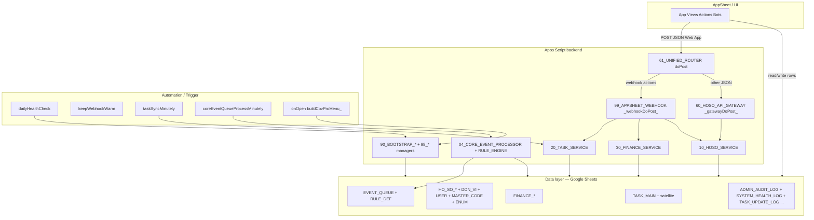

# REPO DESIGN SUMMARY - CBV_SSA_LAOCONG_PRO

## 1. Executive Summary

| Khía cạnh | Nội dung |
|-----------|----------|
| Bản chất repo | Monorepo tài liệu + mã **Google Apps Script** gắn **một Google Spreadsheet** làm DB, vận hành qua **AppSheet** và Web App POST. |
| Vai trò trong CBV_SSA | **MAIN** (runtime + schema + bootstrap chung) chứa đồng thời bounded context **TASK_CENTER**, **HO_SO**, **FINANCE** — không phải repo đơn lẻ chỉ SEARCH/PORTAL. |
| Runtime chính | GAS trong `05_GAS_RUNTIME/`, thứ tự nạp cố định `.clasp.json` → `filePushOrder`; spreadsheet id lấy động `SpreadsheetApp.getActive().getId()`. |
| Rủi ro nổi bật | Trùng khả năng **hai bản webhook** (`.js` vs `.gs`); `schema_manifest.json` **lệch** `CBV_SCHEMA_MANIFEST` cho TASK_MAIN; Web App `ANYONE_ANONYMOUS`; admin email hardcode trong config. |

## 2. Repo Purpose

**Mục tiêu nghiệp vụ:** Hệ “Lao Công PRO” trên nền Sheet — quản lý **công việc (task)** gắn đơn vị/người/chủ thể liên quan, **hồ sơ (HO_SO)** đa loại (kèm file, quan hệ, phương tiện), **giao dịch tài chính**; đồng bộ master/enum/user; có **event queue + rule** để mở rộng tự động hóa; AppSheet là lớp UI/field policy; GAS là service, webhook, audit/health, trigger.

**Đối tượng vận hành:** Admin Sheet/GAS, user AppSheet, tích hợp ngoài (gateway HO_SO cho client kiểu Lovable).

## 3. Current Folder/File Map

| Thư mục gốc | Vai trò |
|-------------|---------|
| `00_META/` | Chuẩn governance, ID, log, module protocol (tài liệu). |
| `00_OVERVIEW/` | Kiến trúc tổng quan, event-driven, naming, mẫu RULE_DEF. |
| `01_SCHEMA/` | Spec schema theo bảng (TASK_MAIN, MASTER_CODE, …). |
| `02_MODULES/` | Mô tả theo module: `TASK_CENTER`, `HO_SO`, `FINANCE` (business, service map, sheet dictionary). |
| `02_SEED/` | TSV seed mẫu (user, …). |
| `03_SHARED/` | Luồng dữ liệu, enum, mapping user–task–finance. |
| `04_APPSHEET/` | Toàn bộ cấu hình/hướng dẫn AppSheet (master, slice, security, checklist). |
| `04_OPERATIONS/` | Menu guide, deployment flow, wrapper map. |
| `05_GAS_RUNTIME/` | **Toàn bộ mã GAS** + `appsscript.json`; `rootDir` của clasp. |
| `06_DATABASE/` | `schema_manifest.json`, CSV generated, báo cáo schema/audit DB. |
| `07_AUTOMATION/` | Spec trigger (tài liệu; matrix có phần “đề xuất”). |
| `07_TEST/` | Runner/assertions **ngoài** clasp (Node hoặc tooling) — CHƯA XÁC MINH môi trường chạy mặc định. |
| `08_STORAGE/` | Quy ước cấu trúc Drive/storage. |
| `09_AUDIT/` | Báo cáo audit theo phase/module. |
| `99_TOOLS/` | Python: build manifest, export schema, sync manifest, … |
| `DEPLOYMENT/`, `scripts/`, `claude*`, `_handoff/` | Hướng dẫn deploy, script phụ, export — không phải runtime GAS. |
| `.cursor/` | Rule IDE (TASK_MAIN PRO baseline, naming). |

**GAS (`05_GAS_RUNTIME/`) — nhóm file theo lớp (không liệt kê hết 100+ file):**

| Prefix / file | Lớp |
|----------------|-----|
| `00_CORE_*`, `01_ENUM_*`, `02_*USER*`, `02_MASTER_CODE_*` | Config, enum, user, master code |
| `03_SHARED_*`, `03_ADMIN_AUDIT_SERVICE.js`, `03_USER_MIGRATION_HELPER.js` | Repository/logger/validation/action registry/pending feedback |
| `04_CORE_*` | EVENT_QUEUE, RULE_DEF processor, triggers time-based cho queue |
| `10_HOSO_*`, `11_PHUONG_TIEN_*` | HO_SO domain |
| `20_TASK_*`, `21_MASTER_DATA_HELPER.js` | Task domain |
| `30_FINANCE_SERVICE.js` | Finance + `registerAction` webhook |
| `40_*`, `45_*`, `46–49_*` | Display mapping, SHARED_WITH, data sync builder/engine |
| `50_APPSHEET_VERIFY.js` | Kiểm tra sẵn sàng AppSheet |
| `60_HOSO_API_GATEWAY.js`, `61_UNIFIED_ROUTER.js` | HTTP POST: gateway + router thống nhất |
| `90_BOOTSTRAP_*`, `95_*`, `96_*`, `98_*`, `99_*` | Bootstrap, menu, triggers, migration, debug, webhook |
| `97_TASK_SYSTEM_*` | Test runner/assertions/mock **trong** GAS |

## 4. System Architecture

| Lớp | Thành phần thực tế |
|-----|-------------------|
| **Data layer** | Các tab Sheet trong `CBV_CONFIG.SHEETS` (`00_CORE_CONFIG.js`): USER_DIRECTORY, MASTER_CODE, ENUM_DICTIONARY, DON_VI, TASK_*, HO_SO_*, FINANCE_*, EVENT_QUEUE, RULE_DEF, DATA_SYNC_*, SYSTEM_HEALTH_LOG, ADMIN_AUDIT_LOG, … Header chuẩn: `CBV_SCHEMA_MANIFEST` (`90_BOOTSTRAP_SCHEMA.js`). |
| **Apps Script backend** | Service: `10_HOSO_SERVICE.js`, `20_TASK_SERVICE.js`, `30_FINANCE_SERVICE.js`; repository `03_SHARED_REPOSITORY.js`, `20_TASK_REPOSITORY.js`, `10_HOSO_REPOSITORY.js`; validation/logger; core event `04_CORE_*.js`. |
| **AppSheet/UI** | Tài liệu `04_APPSHEET/` (slice, security filter, field policy, action map) — **không** chứa binary app; định nghĩa vận hành cho builder AppSheet. |
| **Automation/Trigger** | `90_BOOTSTRAP_INSTALL.js` (daily 08:00 + warm 5 phút), `90_BOOTSTRAP_ON_EDIT.js` (`taskSyncMinutely` 1 phút — CHƯA XÁC MINH đã cài trên mọi môi trường), `04_CORE_EVENT_TRIGGERS.js` (5 phút), `90_BOOTSTRAP_TRIGGERS_ALL.js` (gỡ/cài gói). |
| **Logging/Audit** | `03_SHARED_LOGGER.js` → ADMIN_AUDIT_LOG; `98_audit_logger.js`; `90_BOOTSTRAP_LIFECYCLE.js` → SYSTEM_HEALTH_LOG; task log `TASK_UPDATE_LOG` qua `20_TASK_SERVICE.js`. |
| **Integration/API** | Web App: `61_UNIFIED_ROUTER.js` `doPost`; `99_APPSHEET_WEBHOOK.js` + `registerAction`; `60_HOSO_API_GATEWAY.js` (action string kiểu `getHoSoList`, `createHoSo`, …). `appsscript.json`: webapp `executeAs` USER_DEPLOYING, `access` ANYONE_ANONYMOUS. |

## 5. Data Model

### Bảng/sheet chính (theo `CBV_CONFIG.SHEETS` + `CBV_SCHEMA_MANIFEST`)

| Sheet | Khóa / ghi chú | Quan hệ tóm tắt |
|-------|----------------|-----------------|
| USER_DIRECTORY | PK: **ID** | Được tham chiếu bởi OWNER_ID, REPORTER_ID, MANAGER_USER_ID, ACTOR_ID, … |
| DON_VI | PK: **ID**, cây **PARENT_ID** | TASK_MAIN.DON_VI_ID, FINANCE_TRANSACTION.DON_VI_ID, HO_SO_MASTER.DON_VI_ID |
| MASTER_CODE | PK: **ID**; nhóm **MASTER_GROUP** | Chuẩn hóa mã; HO_SO type/status; task type qua TASK_TYPE_ID (CHI TIẾT: map trong service/validation) |
| ENUM_DICTIONARY | (sheet enum — sync qua `01_ENUM_*`) | Song song MASTER_CODE cho một số nhóm — xem tài liệu ENUM |
| TASK_MAIN | PK: **ID**; **TASK_CODE** sinh/tự điền | OWNER_ID, REPORTER_ID, DON_VI_ID, RELATED_* → entity khác; **SHARED_WITH**, **IS_PRIVATE** (manifest PRO) |
| TASK_CHECKLIST | PK: **ID**; **TASK_ID** → TASK_MAIN | |
| TASK_UPDATE_LOG | **TASK_ID** | Lịch sử/ghi chú workflow |
| TASK_ATTACHMENT | **TASK_ID** | File đính kèm task |
| HO_SO_MASTER | PK: **ID**; CODE/HO_SO_CODE | HTX_ID, DON_VI_ID, quan hệ RELATED_* |
| HO_SO_FILE / HO_SO_RELATION / HO_SO_UPDATE_LOG | **HO_SO_ID** / cặp FROM–TO | Chi tiết & log hồ sơ |
| HO_SO_DETAIL_PHUONG_TIEN | Gắn HO_SO | Service `11_PHUONG_TIEN_SERVICE.js` |
| FINANCE_TRANSACTION | PK: **ID**; RELATED_* | Liên kết đơn vị / entity |
| FINANCE_LOG / FINANCE_ATTACHMENT | **FIN_ID** / FINANCE_ID | |
| FIN_EXPORT_FILTER | Chu kỳ export | Schema trong `90_BOOTSTRAP_SCHEMA.js` (không mở rộng trong bản tóm tắt) |
| EVENT_QUEUE | PK: **ID** | Hàng đợi event; **CORRELATION_ID** |
| RULE_DEF | Định nghĩa rule | Đọc bởi `04_CORE_RULE_ENGINE.js` |
| ADMIN_AUDIT_LOG | PK: **ID** | Audit hành chính |
| SYSTEM_HEALTH_LOG | RUN_ID | Kết quả health/bootstrap |
| DATA_SYNC_CONTROL / DATA_SYNC_BUILDER | Plan + form | `45–49_*.js` |

### Lệch tài liệu đã phát hiện

| Nguồn | TASK_MAIN columns |
|--------|-------------------|
| `90_BOOTSTRAP_SCHEMA.js` `CBV_SCHEMA_MANIFEST` | Có **SHARED_WITH**, **IS_PRIVATE**, **IS_STARRED**, **IS_PINNED**, **PENDING_ACTION** |
| `06_DATABASE/schema_manifest.json` | **Không** có các cột trên (chỉ tới IS_DELETED) — **cần đồng bộ tool/manifest** |

## 6. Main Runtime Flow

Luồng điển hình **AppSheet → Webhook → Task** (tương tự cho finance/hoso qua `registerAction`):

| Bước | Chi tiết |
|------|----------|
| **Input** | POST JSON tới Web App; `61_UNIFIED_ROUTER.js` phân nhánh: nếu `action` ∈ `WEBHOOK_ACTIONS_` hoặc prefix `CMD:` → `_webhookDoPost_` (`99_APPSHEET_WEBHOOK.js`); ngược lại → `_gatewayDoPost_` (`60_HOSO_API_GATEWAY.js`). |
| **Validate** | `_webhookRequireParam`; với task workflow: `getRegisteredAction` + `withPendingFeedback` kiểm **STATUS** (`03_SHARED_PENDING_FEEDBACK.js`); gateway: `_hosoGatewayAuth_`. |
| **Process** | Handler gọi `20_TASK_SERVICE.js` / `30_FINANCE_SERVICE.js` / `hosoSetStatus` (webhook hoso); cập nhật row qua repository. |
| **Log** | TASK_UPDATE_LOG, ADMIN_AUDIT_LOG (khi có); EVENT_QUEUE nếu emit (task sync, hoso events). |
| **Output** | JSON `cbvResponse` hoặc `_jsonOut_`; AppSheet đọc **PENDING_ACTION** trên TASK_MAIN (pattern feedback). |
| **Error handling** | Try/catch ở router/webhook; gateway trả `{ ok: false, message }`; một số đường **silent skip** (STATUS không hợp lệ cho action). |

Luồng **ghi Sheet trực tiếp / AppSheet không gọi createTask GAS:** `taskSyncMinutely` (`90_BOOTSTRAP_ON_EDIT.js`) điền TASK_CODE, ghi log “Task created”, đồng bộ snapshot status → emit **TASK_CREATED** / **TASK_STATUS_CHANGED** (`20_TASK_STATUS_SNAPSHOT.js`, `04_CORE_EVENT_QUEUE.js`).

## 7. Entrypoints

| Loại | Vị trí / hàm |
|------|----------------|
| **Menu** | `90_BOOTSTRAP_MENU.js` `onOpen` → `buildCbvProMenu_()` — CBV PRO: Daily ops, Bootstrap, Audit, Master, Tasks, HO_SO, Finance, Schema, Data sync, Repair, Developer. Wrapper: `90_BOOTSTRAP_MENU_WRAPPERS.js`, `90_BOOTSTRAP_MENU_HELPERS.js`, `10_HOSO_MENU.js`. |
| **Webhook / Web App** | `doPost` → **`61_UNIFIED_ROUTER.js`**; `doGet` ping → `99_APPSHEET_WEBHOOK.js` (và/hoặc bản `.gs` — xem rủi ro). |
| **Trigger** | `dailyHealthCheck` (`90_BOOTSTRAP_TRIGGER.js` + install `90_BOOTSTRAP_INSTALL.js`); `keepWebhookWarm`; `taskSyncMinutely`; `coreEventQueueProcessMinutely`; onEdit installer `90_BOOTSTRAP_ON_EDIT.js` (`installTaskSyncTrigger`). |
| **Worker** | `processCoreEventQueueBatch_` (`04_CORE_EVENT_PROCESSOR.js`); xử lý sync `49_DATA_SYNC_ENGINE.js` `runDataSync`. |
| **Bootstrap/setup** | `90_BOOTSTRAP_INIT.js`, `90_BOOTSTRAP_SCHEMA.js`, `90_BOOTSTRAP_LIFECYCLE.js`, `98_deployment_bootstrap.js` `runFullDeploymentImpl`, `95_TASK_SYSTEM_BOOTSTRAP.js`, `10_HOSO_BOOTSTRAP.js`, `90_BOOTSTRAP_INSTALL.js`, `90_BOOTSTRAP_TRIGGERS_ALL.js`. |
| **Test / health** | Menu: `menuDailyHealthCheck`, `menuRunAllTests`, …; GAS: `97_TASK_SYSTEM_TEST_RUNNER.js` `runAllSystemTestsImpl`, `50_APPSHEET_VERIFY.js`; HO_SO: `10_HOSO_TEST.js`, `smokeTestHoSoGateway` (`60_HOSO_API_GATEWAY.js`); ngoài repo GAS: `07_TEST/CBV_TEST_RUNNER.js` — CHƯA XÁC MINH wiring CI. |

## 8. AppSheet/UI Mapping

| Nguồn | Nội dung |
|-------|----------|
| `04_APPSHEET/00_MASTER/APPSHEET_OPERATOR_INDEX.md` | Điểm vào vận hành. |
| `APPSHEET_SECURITY_FILTERS.md`, `TASK_SLICE_SECURITY_MAP.md` | Row-level security; TASK_MY_* ; **SHARED_WITH / IS_PRIVATE** (rule workspace `.cursor`). |
| `APPSHEET_FIELD_POLICY_MAP*`, `01_TABLES/` | Cột ẩn/bắt buộc/Virtual column — **phụ thuộc cột ảo** nếu expression không khớp schema thật → rủi ro. |
| `APPSHEET_ACTION_MAP_MASTER.md`, webhook actions | Khớp chuỗi `action` với `WEBHOOK_ACTIONS_` và `registerAction`. |

## 9. Automation & Triggers

| Handler | Cài đặt / tần suất (theo code) | File |
|---------|-------------------------------|------|
| `dailyHealthCheck` | Mỗi ngày ~08:00 | `90_BOOTSTRAP_INSTALL.js` |
| `keepWebhookWarm` | Mỗi 5 phút | `90_BOOTSTRAP_INSTALL.js` |
| `taskSyncMinutely` | Mỗi 1 phút (khi đã install) | `90_BOOTSTRAP_ON_EDIT.js` |
| `coreEventQueueProcessMinutely` | Mỗi 5 phút | `04_CORE_EVENT_TRIGGERS.js` |
| `onEditTaskHandler` | onEdit (task) — CHI TIẾT trong `90_BOOTSTRAP_ON_EDIT.js` phần installer | `90_BOOTSTRAP_ON_EDIT.js` |

`CBV_MANAGED_TRIGGER_HANDLERS` (`90_BOOTSTRAP_TRIGGERS_ALL.js`) liệt kê đủ 5 handler trên để gỡ/cài gói.

## 10. Logging & Audit

| Cơ chế | File / sheet |
|--------|----------------|
| Admin audit | `03_SHARED_LOGGER.js` `logAdminAudit` → **ADMIN_AUDIT_LOG** |
| Health tổng hợp | `90_BOOTSTRAP_LIFECYCLE.js` `appendSystemHealthLogRow` → **SYSTEM_HEALTH_LOG** |
| Task history | `20_TASK_SERVICE.js` `_addTaskUpdateLog` / `addTaskLogEntry` → **TASK_UPDATE_LOG** |
| HO_SO audit helpers | `10_HOSO_AUDIT_REPAIR.js`, events `10_HOSO_EVENTS.js` |
| Correlation | `04_CORE_EVENT_QUEUE.js` `cbvSetRequestCorrelationId_` (webhook/gateway) |

## 11. Integration Points

| Đối tượng | Giao thức | Ghi chú |
|-----------|-----------|---------|
| AppSheet | HTTPS POST JSON tới URL Web App | Actions: `WEBHOOK_ACTIONS_` trong `61_UNIFIED_ROUTER.js`; body `CMD:taskStart` được strip trong `_webhookDoPost_`. |
| Lovable / FE | POST JSON `action` + `payload` | `60_HOSO_API_GATEWAY.js`; auth: `LOVABLE_API_TOKEN` (Script Properties) — **nếu không set token thì `_hosoGatewayAuth_` trả true** (mở cửa). |
| Data sync | Sheet-driven plan | Spreadsheet id trong job — `49_DATA_SYNC_ENGINE.js` |

## 12. Legacy vs Current Runtime

| Current / chính | Legacy / nhiễu tiềm ẩn |
|-----------------|------------------------|
| Schema & bootstrap: `CBV_SCHEMA_MANIFEST`, `90_BOOTSTRAP_*`, `98_*` managers | `99_MIGRATION_CLEAN_PRO.js`, `20_TASK_MIGRATION_HELPER.js`, `03_USER_MIGRATION_HELPER.js` — chạy có chủ đích migration |
| Webhook: `99_APPSHEET_WEBHOOK.js` + `registerAction` + `withPendingFeedback` | **`99_APPSHEET_WEBHOOK.gs`**: trùng ý tưởng `doPost`/`withTaskFeedback` nhưng **khác implementation** (vd `deleteAttachment` gọi `deleteTaskAttachment(attachmentId)` không qua registry taskId) — coi là **bản song song / drift** nếu lỡ đưa vào project GAS |
| HO_SO service: tên canonical `hosoCreate`, … (rule workspace) | Gateway **action string** `createHoSo` là **API contract** — không phải tên hàm legacy |
| Event core `EVENT_QUEUE` + `RULE_DEF` | Tài liệu cũ rải rác `04_APPSHEET/99_ARCHIVE` — ưu tiên master mới |

**Ghi chú clasp:** `.clasp.json` `fileExtension: "js"` — file `.gs` **không** nằm trong `filePushOrder`; trên project chỉ push `.js` thì `.gs` có thể chỉ tồn tại trong git (CHƯA XÁC MINH trạng thái project Apps Script thực tế).

## 13. Risks & Technical Debt

| Rủi ro | Bằng chứng / gợi ý |
|--------|-------------------|
| **Hàm/trùng entrypoint** | Hai file webhook `.js` vs `.gs` cùng tên logic; chỉ một `doPost` “thắng” trên GAS — `61_UNIFIED_ROUTER.js` là entry POST chuẩn sau khi push đúng thứ tự. |
| **Thứ tự load** | Vi phạm `filePushOrder` → ReferenceError; `CLASP_PUSH_ORDER.md` và `.clasp.json` là SSOT. |
| **Trigger gọi legacy** | CHƯA XÁC MINH trigger cũ trỏ handler đã đổi tên; ma trận `07_AUTOMATION/TRIGGER_MATRIX.md` có mục “đề xuất mở rộng” chưa khớp code (`remindOverdueTasks` …). |
| **Hardcode ID/email** | `00_CORE_CONFIG.js` **ADMIN_EMAILS** mảng email cụ thể; spreadsheet id **không** hardcode (lấy active). |
| **Idempotent** | Một số luồng có (ensure sheet, triggers no-duplicate); webhook **INVALID_STATUS** silent skip có thể gây “double click” không báo lỗi rõ — chấp nhận thiết kế nhưng cần monitor. |
| **Thiếu log** | Đường skip status / lỗi nhẹ có thể chỉ Logger — CHƯA XÁC MINH đủ ADMIN_AUDIT_LOG cho mọi nhánh gateway. |
| **Health check** | Có `auditSystem` / daily check / `runAllSystemTestsImpl` — phụ thuộc người cài trigger và chạy menu. |
| **AppSheet cột ảo** | Field policy + expression pack; nếu lệch `CBV_SCHEMA_MANIFEST` hoặc thiếu cột trên sheet thật → slice/filter gãy. |
| **Bảo mật Web App** | `appsscript.json` **ANYONE_ANONYMOUS** + gateway auth optional khi không set token → **rủi ro nếu URL lộ**. |

## 14. Recommended Roadmap

### Fix ngay

- Đồng bộ **`06_DATABASE/schema_manifest.json`** với `CBV_SCHEMA_MANIFEST.TASK_MAIN` (SHARED_WITH, IS_PRIVATE, PENDING_ACTION, …).
- Quyết định một nguồn webhook: **xóa hoặc cách ly** `99_APPSHEET_WEBHOOK.gs` khỏi quy trình deploy (chỉ giữ `.js` + `61_UNIFIED_ROUTER.js`) — *chỉ thực hiện khi team chấp nhận thay đổi quy trình* (tài liệu này không sửa code).
- Set **LOVABLE_API_TOKEN** trên production và siết `_hosoGatewayAuth_`; xem lại `access` Web App.

### Chuẩn hóa production

- Checklist deploy: `04_APPSHEET/00_MASTER/`, `DEPLOYMENT/DEPLOYMENT_GUIDE.md`, chạy `menuReinstallAllCbvTriggers` sau thay đổi handler.
- Giám sát SYSTEM_HEALTH_LOG + ADMIN_AUDIT_LOG định kỳ; chuẩn hóa correlationId từ AppSheet.
- Rà soát `WEBHOOK_ACTIONS_` vs mọi `registerAction` (tránh lệch danh sách).

### Tự động hóa / AI hóa sau

- Mở rộng RULE_DEF / EVENT_QUEUE cho nhắc việc, tổng hợp dashboard (`IMPLEMENTATION_ROADMAP.md` giai đoạn 3–4).
- Tooling Python `99_TOOLS/` gắn CI: export schema, so khớp manifest.
- Gợi ý nghiệp vụ dựa trên TASK_UPDATE_LOG + pattern quá hạn (không bắt buộc trong repo hiện tại).

## 15. Acceptance Checklist

| # | Tiêu chí | Trạng thái |
|---|----------|------------|
| 1 | Đã quét cấu trúc thư mục gốc + `05_GAS_RUNTIME` | Đạt |
| 2 | Xác định module: **MAIN** (đa domain TASK/HO_SO/FINANCE) | Đạt |
| 3 | Tóm tắt mục tiêu nghiệp vụ | Đạt |
| 4 | Kiến trúc theo 6 lớp yêu cầu | Đạt (mục 4) |
| 5 | Bảng chính, PK, quan hệ | Đạt (mục 5) |
| 6 | Entrypoints: menu, webhook, trigger, worker, bootstrap, test | Đạt (mục 7) |
| 7 | Luồng: input → validate → process → log → output → error | Đạt (mục 6) |
| 8 | Legacy vs runtime | Đạt (mục 12) |
| 9 | Rủi ro & nợ kỹ thuật | Đạt (mục 13) |
| 10 | Roadmap 3 mức | Đạt (mục 14) |
| 11 | Không sửa code / không xóa file trong phiên làm việc này | Đạt |

## 16. Open Questions

1. Trên project Apps Script production, file **`99_APPSHEET_WEBHOOK.gs` có tồn tại không** hay chỉ `clasp push` `.js`? (ảnh hưởng trùng `doPost`/`doGet`.)
2. Trigger **`onEditTaskHandler`** và **`taskSyncMinutely`** đã được cài đồng bộ trên mọi spreadsheet triển khai chưa?
3. AppSheet app id / copy — **CHƯA XÁC MINH** trong repo (chỉ có tài liệu); cần mapping môi trường Dev/Prod?
4. `07_TEST/CBV_TEST_RUNNER.js` chạy trong pipeline nào (Node version, secrets)? CHƯA XÁC MINH.
5. Finance webhook actions `finConfirm` / `finCancel` / `finArchive` — cần đối chiếu đầy đủ với cấu hình AppSheet production (chỉ thấy đăng ký trong `30_FINANCE_SERVICE.js` qua grep).

---

*Tài liệu sinh từ phân tích repo tại workspace; cập nhật khi schema hoặc `filePushOrder` thay đổi.*
